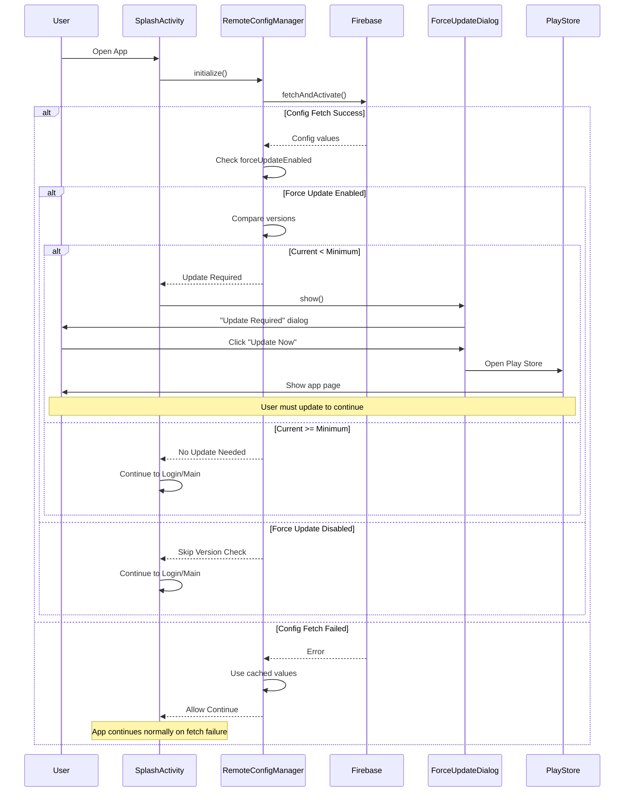

# Design Document: FCM Notifications and Force Update System

## Overview

This design implements a comprehensive push notification system using Firebase Cloud Messaging (FCM) with rich media support and a force update mechanism using Firebase Remote Config. The system handles notification permissions intelligently with a time-based retry mechanism, displays notifications with images of any aspect ratio, and ensures users are on supported app versions.

The architecture follows Android best practices for notification handling, permission requests, and background service integration. The design prioritizes user experience with non-intrusive permission requests while ensuring critical notifications reach users.

## Architecture

### High-Level Components

```
┌─────────────────────────────────────────────────────────────────┐
│                        Application Layer                         │
├─────────────────────────────────────────────────────────────────┤
│  LoginActivity    │   HomeFragment    │   SplashActivity        │
│  (Permission 1)   │  (Permission 2)   │  (Force Update Check)   │
└─────────────────────────────────────────────────────────────────┘
                              │
┌─────────────────────────────┼─────────────────────────────────┐
│                             ▼                                   │
│                  Permission Manager                             │
│  - Tracks permission state                                      │
│  - Manages 30-day retry logic                                   │
│  - Stores rejection timestamps                                  │
└─────────────────────────────────────────────────────────────────┘
                              │
┌─────────────────────────────┼─────────────────────────────────┐
│                             ▼                                   │
│              Firebase Cloud Messaging Layer                     │
│  ┌───────────────────────────────────────────────────┐         │
│  │   FCM Service (extends FirebaseMessagingService)  │         │
│  │   - Receives push notifications                   │         │
│  │   - Handles foreground/background delivery        │         │
│  │   - Downloads and processes images                │         │
│  │   - Displays rich media notifications             │         │
│  └───────────────────────────────────────────────────┘         │
└─────────────────────────────────────────────────────────────────┘
                              │
┌─────────────────────────────┼─────────────────────────────────┐
│                             ▼                                   │
│              Firebase Remote Config Layer                       │
│  ┌───────────────────────────────────────────────────┐         │
│  │         Remote Config Manager                     │         │
│  │   - Fetches minimum version requirements          │         │
│  │   - Checks force update enabled flag              │         │
│  │   - Caches config values                          │         │
│  └───────────────────────────────────────────────────┘         │
└─────────────────────────────────────────────────────────────────┘
                              │
                              ▼
                   ┌────────────────────┐
                   │   Force Update UI  │
                   │   - Non-dismissible│
                   │   - Play Store link│
                   └────────────────────┘
```

### Force Update Flow (Detailed)



**Step-by-Step Force Update Implementation**:

1. **App Launch** (SplashActivity.onCreate):
   ```kotlin
   val configManager = RemoteConfigManager(this)
   configManager.initialize()
   configManager.fetchConfig { success ->
       if (configManager.isUpdateRequired()) {
           showForceUpdateDialog()
       } else {
           proceedToNextScreen()
       }
   }
   ```

2. **Remote Config Fetch**:
   - Firebase Remote Config fetches latest values from server
   - Keys fetched: `force_update_enabled` (Boolean), `min_android_version` (String)
   - Cache expiration: 1 hour (subsequent launches use cache if < 1 hour old)
   - On failure: Use previously cached values or default values

3. **Version Comparison**:
   ```kotlin
   // Current app version from build.gradle.kts
   val currentVersion = BuildConfig.VERSION_CODE  // e.g., 5
   
   // Minimum version from Remote Config
   val minVersionString = remoteConfig.getString("min_android_version")  // e.g., "6.0"
   val minVersionCode = parseVersionString(minVersionString)  // Converts to 6
   
   // Compare
   val updateRequired = currentVersion < minVersionCode
   ```

4. **Dialog Display** (if update required):
   - Create ForceUpdateDialog instance
   - Set `setCancelable(false)` to prevent dismissal
   - Show using `show(fragmentManager, "force_update")`
   - Dialog blocks all app access

5. **Play Store Redirect**:
   ```kotlin
   private fun openPlayStore() {
       val packageName = context.packageName
       try {
           // Try to open Play Store app
           val intent = Intent(Intent.ACTION_VIEW).apply {
               data = Uri.parse("market://details?id=$packageName")
               setPackage("com.android.vending")
           }
           startActivity(intent)
       } catch (e: ActivityNotFoundException) {
           // Fall back to browser if Play Store not installed
           val intent = Intent(Intent.ACTION_VIEW).apply {
               data = Uri.parse("https://play.google.com/store/apps/details?id=$packageName")
           }
           startActivity(intent)
       }
   }
   ```

6. **User Updates App**:
   - User goes to Play Store
   - Downloads and installs update
   - Reopens app
   - New version passes version check
   - User proceeds to app normally

**Firebase Console Configuration**:

In Firebase Console → Remote Config, create these parameters:

| Parameter | Type | Default Value | Description |
|-----------|------|---------------|-------------|
| `force_update_enabled` | Boolean | `false` | Master switch for force update feature |
| `min_android_version` | String | `"5.0"` | Minimum required app version |

**To Trigger Force Update**:
1. Go to Firebase Console → Remote Config
2. Update `min_android_version` to target version (e.g., "6.0")
3. Set `force_update_enabled` to `true`
4. Publish changes
5. Users on older versions will see force update dialog on next app launch

**Version String Format**:
- Supports: "5.0", "5", "10.2.1"
- Converts to comparable integer: "5.0" → 5000, "10.2.1" → 10002001
- Allows proper version comparison

### Component Interaction Flow

1. **App Startup Flow**:
   - SplashActivity → RemoteConfigManager.fetchAndCheckForceUpdate()
   - If update required → Show ForceUpdateDialog
   - If no update → Continue to LoginActivity or MainActivity

2. **Notification Permission Flow**:
   - LoginActivity.onCreate() → PermissionManager.requestIfNeeded()
   - If rejected → Store timestamp, skip
   - HomeFragment.onResume() → PermissionManager.requestIfNeeded()
   - If rejected → Store timestamp, check 30-day interval
   - After 30 days → Request again

3. **Notification Delivery Flow**:
   - FCM → InstagameFCMService.onMessageReceived()
   - Parse notification payload (title, body, imageUrl)
   - If image present → ImageLoader.download()
   - Build notification with image (scaled to fit)
   - Display via NotificationManager

## Components and Interfaces

### 1. NotificationPermissionManager

**Purpose**: Centralized management of notification permission requests and rejection tracking.

```kotlin
class NotificationPermissionManager(private val context: Context) {
    
    companion object {
        private const val PREFS_NAME = "notification_permission_prefs"
        private const val KEY_LAST_REJECTION_TIMESTAMP = "last_rejection_timestamp"
        private const val KEY_PERMISSION_PERMANENTLY_DENIED = "permission_permanently_denied"
        private const val RETRY_INTERVAL_MS = 30L * 24 * 60 * 60 * 1000 // 30 days
    }
    
    /**
     * Check if we should request notification permission
     * Returns true if permission not granted and either:
     * - Never been rejected
     * - 30 days have passed since last rejection
     */
    fun shouldRequestPermission(): Boolean
    
    /**
     * Request notification permission with proper handling
     * Updates rejection timestamp if denied
     */
    fun requestPermission(activity: Activity, requestCode: Int)
    
    /**
     * Handle permission result from activity
     */
    fun handlePermissionResult(granted: Boolean)
    
    /**
     * Check if notification permission is granted
     */
    fun isPermissionGranted(): Boolean
    
    /**
     * Mark permission as permanently denied (never ask again selected)
     */
    fun markPermanentlyDenied()
    
    /**
     * Get days remaining until next retry
     */
    fun getDaysUntilNextRetry(): Int
    
    /**
     * Clear rejection timestamp (for testing/debugging)
     */
    fun clearRejectionTimestamp()
}
```

### 2. InstagameFCMService

**Purpose**: Handle incoming FCM data-only messages and display rich notifications.

**Important**: This service uses **data payload only** (not notification payload) for full control over notification display, image handling, and custom routing.

```kotlin
class InstagameFCMService : FirebaseMessagingService() {
    
    /**
     * Called when a new FCM data message is received
     * Handles both foreground and background delivery
     * Note: Only triggered for DATA payloads, not notification payloads
     */
    override fun onMessageReceived(remoteMessage: RemoteMessage)
    
    /**
     * Called when FCM token is refreshed
     * Updates token in Firebase Realtime Database
     */
    override fun onNewToken(token: String)
    
    /**
     * Build and display notification with image
     */
    private fun showNotification(
        title: String,
        body: String,
        imageUrl: String?,
        data: Map<String, String>
    )
    
    /**
     * Download image from URL and convert to Bitmap
     * Handles failures gracefully
     */
    private fun downloadImage(imageUrl: String): Bitmap?
    
    /**
     * Create notification channel (Android 8.0+)
     */
    private fun createNotificationChannel()
    
    /**
     * Handle notification tap - route to appropriate screen
     */
    private fun createPendingIntent(data: Map<String, String>): PendingIntent
}
```

### 3. RemoteConfigManager

**Purpose**: Fetch and manage Firebase Remote Config values for force update.

```kotlin
class RemoteConfigManager(private val context: Context) {
    
    companion object {
        private const val KEY_MIN_ANDROID_VERSION = "min_android_version"
        private const val KEY_FORCE_UPDATE_ENABLED = "force_update_enabled"
        private const val CACHE_EXPIRATION_SECONDS = 3600L // 1 hour
    }
    
    private val remoteConfig: FirebaseRemoteConfig = FirebaseRemoteConfig.getInstance()
    
    /**
     * Initialize Remote Config with default values
     * Sets cache expiration and default values for config parameters
     */
    fun initialize()
    
    /**
     * Fetch latest config from server
     * Uses cached values if fetch fails
     * @param onComplete Callback with success status
     */
    fun fetchConfig(onComplete: (Boolean) -> Unit)
    
    /**
     * Check if current app version meets minimum requirement
     * Compares BuildConfig.VERSION_CODE with minimum required version
     * Returns true if update is required
     */
    fun isUpdateRequired(): Boolean
    
    /**
     * Check if force update feature is enabled
     * Returns false if fetch failed or key not present
     */
    fun isForceUpdateEnabled(): Boolean
    
    /**
     * Get minimum required version code
     * Parses version string from Remote Config
     * Returns 0 if invalid or missing
     */
    fun getMinimumVersionCode(): Int
    
    /**
     * Parse version string (e.g., "5.0" or "10.2.1") to version code
     * Handles major.minor.patch format
     * Returns comparable integer representation
     */
    private fun parseVersionString(version: String): Int
}
```

**Implementation Flow**:
1. On app initialization, set default config values
2. Fetch config from server with 1-hour cache
3. Compare current version (BuildConfig.VERSION_CODE) with minimum version from config
4. If update required and enabled, trigger force update flow
5. If fetch fails, use cached values from previous fetch

**Version Comparison Logic**:
```kotlin
fun isUpdateRequired(): Boolean {
    if (!isForceUpdateEnabled()) return false
    
    val currentVersion = BuildConfig.VERSION_CODE
    val minimumVersion = getMinimumVersionCode()
    
    return currentVersion < minimumVersion
}
```

### 4. ForceUpdateDialog

**Purpose**: Non-dismissible dialog that prompts users to update the app.

```kotlin
class ForceUpdateDialog : DialogFragment() {
    
    companion object {
        fun newInstance(minimumVersion: String): ForceUpdateDialog
        private const val ARG_MIN_VERSION = "min_version"
    }
    
    /**
     * Create non-dismissible dialog with custom layout
     * Shows update message and minimum version requirement
     * Prevents dismissal via setCancelable(false)
     */
    override fun onCreateDialog(savedInstanceState: Bundle?): Dialog
    
    /**
     * Override to prevent back button dismissal
     * Returns true to consume back press without closing
     */
    override fun onCreateView(...)
    
    /**
     * Open Play Store to app page
     * Uses Intent with ACTION_VIEW and market:// URI
     * Falls back to web URL if Play Store not installed
     */
    private fun openPlayStore()
    
    /**
     * Prevent dismissal on outside touch
     * Set cancelable to false and dismiss on back press disabled
     */
    override fun setCancelable(cancelable: Boolean)
}
```

**Dialog Layout**:
- Title: "Update Required"
- Message: "To continue using Instagame, please update to version X.X or higher"
- Single button: "Update Now" (redirects to Play Store)
- No dismiss or cancel options
- Blocks all app access until user updates

**Implementation Details**:
```kotlin
override fun onCreateDialog(savedInstanceState: Bundle?): Dialog {
    val minVersion = arguments?.getString(ARG_MIN_VERSION) ?: "latest"
    
    return AlertDialog.Builder(requireContext())
        .setTitle("Update Required")
        .setMessage("To continue using Instagame, please update to version $minVersion or higher")
        .setPositiveButton("Update Now") { _, _ ->
            openPlayStore()
        }
        .setCancelable(false)  // Cannot dismiss by tapping outside
        .create()
        .apply {
            setCanceledOnTouchOutside(false)  // Prevent outside touch dismissal
        }
}

// Override back button to prevent dismissal
override fun onResume() {
    super.onResume()
    dialog?.setOnKeyListener { _, keyCode, event ->
        if (keyCode == KeyEvent.KEYCODE_BACK && event.action == KeyEvent.ACTION_UP) {
            // Consume back press, don't dismiss
            true
        } else {
            false
        }
    }
}
```

### 5. FCMTokenManager

**Purpose**: Manage FCM token registration and updates.

```kotlin
class FCMTokenManager(private val context: Context) {
    
    /**
     * Register FCM token with Firebase Realtime Database
     */
    fun registerToken()
    
    /**
     * Update token in database when refreshed
     */
    fun updateToken(newToken: String)
    
    /**
     * Get current FCM token
     */
    fun getCurrentToken(onComplete: (String?) -> Unit)
    
    /**
     * Save token to user's profile in database
     */
    private fun saveTokenToDatabase(userId: String, token: String)
}
```

## Data Models

### FCM Data Payload Structure

**Server-side JSON (Data-only payload)**:
```json
{
  "to": "<FCM_TOKEN>",
  "data": {
    "title": "New Game Available!",
    "body": "Check out the latest game on Instagame",
    "imageUrl": "https://example.com/image.jpg",
    "action": "open_game",
    "targetId": "game123"
  }
}
```

**Key Points**:
- ✅ Uses `data` field only (NOT `notification` field)
- ✅ Ensures `onMessageReceived()` is always called (foreground + background)
- ✅ Allows full control over notification building
- ✅ Supports custom image processing and aspect ratio handling
- ✅ Enables custom click routing

**Why NOT notification payload**:
- ❌ System handles notification automatically (less control)
- ❌ `onMessageReceived()` NOT called when app is in background
- ❌ Limited image customization
- ❌ Can't handle dynamic aspect ratios properly

### NotificationPayload

```kotlin
data class NotificationPayload(
    val title: String,
    val body: String,
    val imageUrl: String? = null,
    val action: String? = null,  // e.g., "open_game", "open_profile"
    val targetId: String? = null  // e.g., gameId, userId
)
```

### RemoteConfigData

```kotlin
data class RemoteConfigData(
    val minAndroidVersion: String,    // e.g., "5.0"
    val forceUpdateEnabled: Boolean,
    val minAndroidVersionCode: Int    // Parsed from version string
)
```

### PermissionState

```kotlin
data class PermissionState(
    val isGranted: Boolean,
    val lastRejectionTimestamp: Long,
    val isPermanentlyDenied: Boolean,
    val canRequestAgain: Boolean
)
```

## Correctness Properties


*A property is a characteristic or behavior that should hold true across all valid executions of a system—essentially, a formal statement about what the system should do. Properties serve as the bridge between human-readable specifications and machine-verifiable correctness guarantees.*

### Property 1: Notification image display

*For any* notification with a valid image URL, when processed by the FCM service, the resulting notification should contain the downloaded image
**Validates: Requirements 1.1**

### Property 2: Aspect ratio handling

*For any* image with any aspect ratio (portrait, landscape, square, or extreme ratios), when displayed in a notification, the image should be scaled to fit without distortion
**Validates: Requirements 1.2**

### Property 3: Text content preservation

*For any* notification containing title and body text along with an image, both the title and body should be visible in the displayed notification
**Validates: Requirements 1.3**

### Property 4: Graceful image failure

*For any* notification where the image download fails (network error, invalid URL, etc.), the notification should still display with the title and body text intact
**Validates: Requirements 1.4**

### Property 5: Notification routing

*For any* notification payload with a specific action and target ID, tapping the notification should route to the correct screen corresponding to that action
**Validates: Requirements 1.5**

### Property 6: Version comparison logic

*For any* pair of version codes (current and minimum), if current version is less than minimum version, the force update check should return true
**Validates: Requirements 2.2**

### Property 7: Remote Config fallback

*For any* Remote Config fetch failure, the app should continue to function normally without blocking the user
**Validates: Requirements 2.5**

### Property 8: Permission request at sign-in

*For any* sign-in completion event, if notification permission is neither granted nor permanently denied, the system should request permission
**Validates: Requirements 3.1**

### Property 9: Permission retry at Home

*For any* navigation to Home Fragment, if permission was rejected at sign-in, the system should request permission again
**Validates: Requirements 3.2**

### Property 10: Rejection timestamp storage

*For any* notification permission rejection, the current timestamp should be stored in SharedPreferences
**Validates: Requirements 3.3**

### Property 11: 30-day retry interval

*For any* rejection timestamp, if 30 days have elapsed, the system should allow permission request again
**Validates: Requirements 3.4**

### Property 12: Timestamp update on retry rejection

*For any* permission rejection after a 30-day interval, the rejection timestamp should be updated to the current time
**Validates: Requirements 3.5**

### Property 13: FCM token database sync

*For any* FCM token refresh event, the new token should be updated in the Firebase Realtime Database under the user's profile
**Validates: Requirements 4.2**

### Property 14: Foreground notification display

*For any* notification received while the app is in foreground, the notification should be displayed to the user
**Validates: Requirements 4.3**

### Property 15: Background notification display

*For any* notification received while the app is in background, the notification should be displayed automatically
**Validates: Requirements 4.4**

### Property 16: Token registration after permission grant

*For any* permission grant event, FCM token registration should be triggered immediately
**Validates: Requirements 4.5**

### Property 17: Force update flag behavior

*For any* app version state, when force update flag is disabled, version checks should be skipped regardless of version
**Validates: Requirements 5.3**

### Property 18: Invalid config handling

*For any* invalid or missing minimum version string in Remote Config, the system should treat it as no update required
**Validates: Requirements 5.5**

### Property 19: Remote Config cached values

*For any* Remote Config fetch failure, if cached values exist, the system should use those cached values
**Validates: Requirements 7.3**

### Property 20: Exception resilience

*For any* exception during notification processing, the system should handle it gracefully without crashing the application
**Validates: Requirements 7.5**

## Error Handling

### Notification Delivery Errors

1. **Image Download Failure**:
   - Catch all network exceptions during image download
   - Log the failure with URL and error details
   - Display notification without image (title and body only)
   - Continue normal execution

2. **Invalid Image URL**:
   - Validate URL format before attempting download
   - Handle malformed URLs gracefully
   - Display text-only notification
   - Log warning for monitoring

3. **Memory Issues**:
   - Use Glide or Coil for efficient image loading with automatic memory management
   - Set maximum bitmap size limits
   - Implement image compression if needed
   - Handle OutOfMemoryError gracefully

### Permission Request Errors

1. **Permission Denied**:
   - Store rejection timestamp immediately
   - Do not show error message (respect user choice)
   - Update UI state if needed
   - Schedule next retry after 30 days

2. **Permanently Denied (Never Ask Again)**:
   - Mark flag in SharedPreferences
   - Stop automatic permission requests
   - Optionally show settings button in notification settings
   - Log for analytics

3. **Activity Destroyed During Request**:
   - Handle ActivityNotFoundException
   - Skip permission request for this cycle
   - Retry on next eligible trigger point

### Remote Config Errors

1. **Network Failure**:
   - Use exponential backoff for retries
   - Fall back to cached config values
   - Allow app to continue normally
   - Log failure for monitoring

2. **Parse Errors**:
   - Validate config value formats
   - Use default values if parse fails
   - Treat as "no update required"
   - Log warning with details

3. **Timeout**:
   - Set reasonable timeout (10 seconds)
   - Use cached values on timeout
   - Continue app startup
   - Log timeout event

### FCM Token Registration Errors

1. **No Network**:
   - Queue token registration for retry
   - Use WorkManager for background retry
   - Don't block user flow
   - Retry when network available

2. **Firebase Auth Not Ready**:
   - Wait for auth state change
   - Retry after successful authentication
   - Handle null user gracefully
   - Log warning

3. **Database Write Failure**:
   - Retry with exponential backoff
   - Queue update for later
   - Don't crash or block
   - Log error with user ID

## Testing Strategy

### Unit Testing

**NotificationPermissionManager**:
- Test permission state detection across different Android versions
- Test 30-day calculation with various timestamps
- Test SharedPreferences read/write operations
- Test permanently denied flag behavior

**RemoteConfigManager**:
- Test version comparison logic with edge cases
- Test config value parsing (valid and invalid inputs)
- Test cache behavior on fetch failures
- Test default value handling

**FCMTokenManager**:
- Test token registration flow
- Test database update logic
- Test token retrieval from Firebase

**Notification Building**:
- Test notification builder with and without images
- Test PendingIntent creation for different actions
- Test notification channel creation

### Property-Based Testing

**Property Testing Framework**: jqwik (already in dependencies)

**Test Generators Needed**:
1. **ArbitraryNotificationPayload**: Generate random notification payloads with varying title/body lengths and optional image URLs
2. **ArbitraryVersionCode**: Generate random version codes for comparison testing
3. **ArbitraryTimestamp**: Generate timestamps for testing 30-day intervals
4. **ArbitraryImageAspectRatio**: Generate images with various aspect ratios (0.5 to 3.0)
5. **ArbitraryPermissionState**: Generate various permission states (granted, denied, permanently denied)

**Property Test Coverage**:
- Version comparison logic (Property 6)
- Permission retry intervals (Property 11, 12)
- Notification routing (Property 5)
- Image aspect ratio handling (Property 2)
- Token sync behavior (Property 13)
- Config fallback behavior (Property 7, 19)

### Integration Testing

**FCM Integration**:
- Test FCM service receives and processes messages
- Test foreground vs background notification display
- Test notification tap handling
- Test token refresh flow

**Remote Config Integration**:
- Test config fetch on app startup
- Test force update dialog display
- Test Play Store navigation
- Test config caching

**Permission Flow Integration**:
- Test permission request at sign-in
- Test permission request at Home Fragment
- Test 30-day retry flow end-to-end
- Test permission grant triggers token registration

### UI/Instrumentation Testing

**Force Update Dialog**:
- Verify dialog is non-dismissible
- Verify back button doesn't close dialog
- Verify Play Store link opens correctly
- Verify dialog appearance and layout

**Notification Display**:
- Verify notifications appear in status bar
- Verify images scale correctly
- Verify text is readable
- Verify notification tap opens correct screen

**Permission Dialogs**:
- Verify system permission dialog appears
- Verify handling of user responses
- Verify timing of requests (sign-in, Home Fragment)

## Implementation Notes

### Android Version Considerations

- **Android 13+ (API 33)**: POST_NOTIFICATIONS runtime permission required
- **Android 12- (API 32)**: Notifications allowed by default, no permission needed
- **Android 8.0+ (API 26)**: Notification channels required
- **Android 7.0+ (API 24)**: App minimum SDK

### Firebase Setup Requirements

1. **Firebase Console Configuration**:
   - Enable Cloud Messaging in Firebase Console
   - Add google-services.json to app directory
   - Configure Remote Config with default values:
     - `min_android_version`: "5.0"
     - `force_update_enabled`: false

2. **Gradle Dependencies** (already present):
   - Firebase BOM for version management
   - Firebase Auth
   - Firebase Realtime Database
   - Need to add: Firebase Messaging
   - Need to add: Firebase Remote Config

3. **AndroidManifest.xml**:
   - POST_NOTIFICATIONS permission (already present)
   - FCM service declaration
   - Default notification icon
   - Default notification color

### FCM Payload Processing

**Server-Side Implementation** (Node.js/Firebase Admin SDK example):
```javascript
// Correct: Data-only payload
const message = {
  token: userFcmToken,
  data: {
    title: "New Game Available!",
    body: "Check out the latest game",
    imageUrl: "https://example.com/game-image.jpg",
    action: "open_game",
    targetId: "game123"
  }
};

// Send via Firebase Admin SDK
admin.messaging().send(message);
```

**Client-Side Processing** (Android):
```kotlin
override fun onMessageReceived(remoteMessage: RemoteMessage) {
    // Extract data payload
    val data = remoteMessage.data
    
    if (data.isNotEmpty()) {
        val title = data["title"] ?: "Instagame"
        val body = data["body"] ?: ""
        val imageUrl = data["imageUrl"]
        val action = data["action"]
        val targetId = data["targetId"]
        
        // Build and display notification with full control
        showNotification(title, body, imageUrl, action, targetId)
    }
}
```

**Testing Payload** (using Firebase Console or curl):
```bash
curl -X POST https://fcm.googleapis.com/fcm/send \
  -H "Authorization: Bearer <YOUR_SERVER_KEY>" \
  -H "Content-Type: application/json" \
  -d '{
    "to": "<DEVICE_FCM_TOKEN>",
    "data": {
      "title": "Test Notification",
      "body": "This is a test with an image",
      "imageUrl": "https://picsum.photos/800/600",
      "action": "open_home"
    }
  }'
```

### Image Handling Best Practices

1. **Use Glide or Coil for Image Loading**:
   - Already using Glide in the project
   - Leverage Glide's caching and memory management
   - Use Glide's target API for notifications

2. **Image Sizing**:
   - BigPictureStyle for rich notifications
   - Scale images to max width of 450dp
   - Maintain aspect ratio during scaling
   - Compress if needed to stay under size limits

3. **Bitmap Management**:
   - Recycle bitmaps after use
   - Set inSampleSize based on required dimensions
   - Use RGB_565 for notification images (smaller memory footprint)

### Notification Channel Design

**Channel ID**: "instagame_general"
**Channel Name**: "General Notifications"
**Importance**: HIGH (shows everywhere, makes noise)
**Description**: "Updates, new content, and important announcements"

Additional channels can be added later for:
- Social notifications (likes, comments, follows)
- System notifications (app updates, maintenance)
- Promotional notifications (offers, events)

### Deep Link Handling in Notifications

Notification payloads should support these actions:
- `open_game`: Opens specific game (requires `game_id`)
- `open_profile`: Opens user profile (requires `user_id`)
- `open_video`: Opens specific video (requires `video_id`)
- `open_home`: Opens home screen
- `open_url`: Opens web URL (requires `url`)

### SharedPreferences Structure

**File Name**: `notification_prefs`

**Keys**:
- `last_rejection_timestamp`: Long (milliseconds since epoch)
- `permission_permanently_denied`: Boolean
- `fcm_token`: String (current FCM token)
- `fcm_token_synced`: Boolean (token saved to database)

### Performance Considerations

1. **Config Fetch**: 
   - Fetch asynchronously on splash screen
   - Use 1-hour cache expiration
   - Don't block app startup

2. **Image Download**:
   - Download on background thread
   - Set 10-second timeout
   - Cache downloaded images

3. **Permission Checks**:
   - Cache permission state to avoid repeated system calls
   - Check once per app session
   - Update cache on permission change

4. **Token Registration**:
   - Use WorkManager for reliable background execution
   - Retry with exponential backoff
   - Batch multiple token updates

### Security Considerations

1. **Token Security**:
   - Never expose FCM tokens in logs
   - Store tokens securely in Firebase
   - Validate token before database updates

2. **Notification Validation**:
   - Validate notification payload structure
   - Sanitize image URLs before download
   - Validate deep link targets

3. **Remote Config**:
   - Validate version strings before parsing
   - Handle malicious config values gracefully
   - Use safe default values

## Dependencies to Add

```kotlin
// Firebase Cloud Messaging
implementation("com.google.firebase:firebase-messaging-ktx")

// Firebase Remote Config
implementation("com.google.firebase:firebase-config-ktx")

// WorkManager for background tasks (already present)
// implementation(libs.work.runtime.ktx)

// Glide for image loading (already present)
// implementation(libs.glide)
```

## Migration Strategy

Since this is a new feature, migration considerations:

1. **Existing Users**:
   - First launch after update: Check permission status
   - If granted: Register FCM token immediately
   - If not granted: Follow normal permission flow

2. **Token Migration**:
   - Check if user has existing token in database
   - If yes: Verify it's current token, update if needed
   - If no: Register new token

3. **Config Initialization**:
   - First fetch on splash screen
   - Set reasonable default values
   - Cache for offline scenarios

4. **Notification Channels**:
   - Create channels on first app launch after update
   - Safe to create multiple times (idempotent operation)
